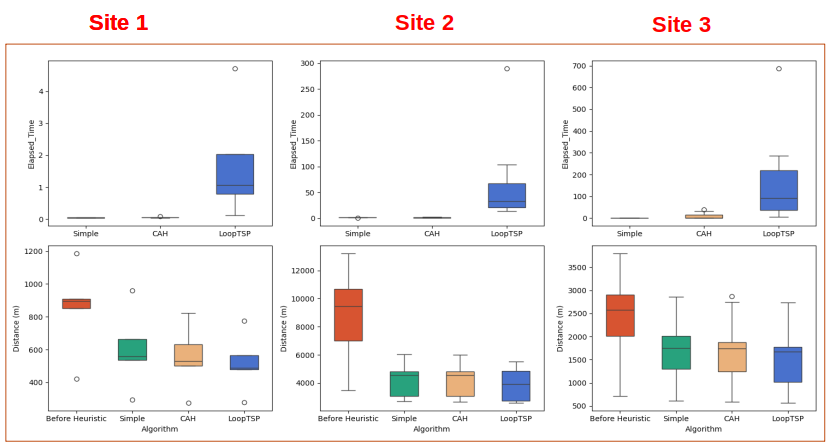

# I am Loubna Taleb  

**Data Science and Robotics Engineer**  
Specialized in **AI**, **optimization**, and **computer vision**  

---

# Education  

**ISIMA – Clermont-Ferrand (2022–2025)**  
Engineering School in Computer Science – Specialization in Optimization and Artificial Intelligence  
Third-year GPA: 15/20 (Very Good)  

**EUPI – Clermont-Ferrand (2024–2025)**  
Master’s Degree in Robotics and Artificial Perception (Double degree with ISIMA)  
GPA: 15/20 (Very Good)  

**CPGE – Morocco, Meknes & Marrakech (2020–2022)**  
Preparatory Classes for Engineering Schools (PCSI/PSI*)  
- **PCSI**: Ranked among the top students, admitted to PSI* at Ibn Timiya in Marrakech  
- **PSI***: Admitted to ISIMA through the CCINP national entrance exam  
- Also admitted to EMI (Military School of Engineering, Morocco) with a national ranking of **17/910**  

**Baccalaureate – Morocco, ZAIO (2020)**  
Scientific Baccalaureate in Physics and Chemistry  
National GPA: **17.55/20**

---

# Professional Experience  

**Internship – Optimization of Drone Inspections in Energy Facilities**  
*TotalEnergies – April 2025 to September 2025, Pau, France*  

- Developed **automatic mission planning algorithms** for drone inspection of georeferenced energy facilities.  
- Designed **internal software interfaces** to facilitate mission preparation and export of **KMZ files** compatible with **DJI drones**.  
- Implemented **intelligent planning algorithms** (**A***, **TSP**) to maximize drone autonomy.  
- **Tools:** Python, QGIS, Git, CloudCompare, A*, TSP  
- **Recognition:** Commended by the evaluation committee  

  
  

---

**Internship – Modeling and Machine Learning**  
*INRAE – March 2024 to August 2024, Clermont-Ferrand, France*  

- Developed a decision-support tool for **forest management under climate change**.  
- Applied **genetic algorithms in Java** for silvicultural optimization.  
- Conducted **predictive modeling in Python** for ecological simulations to support **sustainable management**.  
- **Tools:** Java, Python, PyTorch, Git  
- **Recognition:** Very good evaluation  
- 📄 [View presentation (PDF)](assets/stages/INRAE/Orale_TALEB_loubna_ZZ2_F4-1.pdf)  
- 💻 [Access INRAE project code](assets/stages/INRAE/codes_Inrae)  

  

# Projects
## SafeWay – Sopra Steria Hackathon, October 2024

Development of a **team web project** to find the **safest routes for pedestrians** based on different user profiles: women, men, disabled people, elderly, etc., using **user feedback** and city data from **Clermont-Ferrand**.  

My role included:  
- Developing **Dijkstra heuristics** to find the **safest and shortest paths** with an **alpha parameter** to balance safety and distance.  
- Creating the **graph structure** for shortest-path calculations.  
- Designing the **first web interface** to collect and store user and city data.  

**Results:**  
- 1st place for **communication**  
- 2nd place for **coding part**  

📄 [View presentation (PDF)](/assets/Projects/SafeWay/app.py)  
💻 [Access SafeWay project code](assets/Projects/SafeWay/safeway_codes)  
<video width="400" controls>
  <source src="assets/Projects/SafeWay/demoSafeway.mp4" type="video/mp4">
  Your browser does not support the video tag.
</video>

